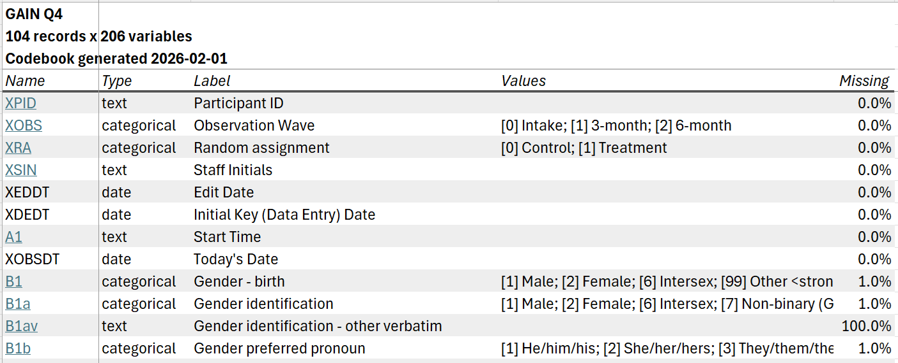

<!-- README.md is generated from README.Rmd. Please edit that file -->

```{r, include = FALSE}
knitr::opts_chunk$set(
  collapse = TRUE,
  comment = "#",
  out.width = "100%",
  fig.align = "center",
  fig.path = "man/figures/",
  eval = FALSE
)
```

# lighthouse.codebook

The lighthouse.codebook package includes tools to summarize a dataset into a formatted 
Excel workbook, including a data dictionary and vrariable summaries. It incorporates external 
metadata (such as variable labels, value labels, and user missing / non-response codes), 
with functions for using metadata from SPSS and REDCap datasets. Codebooks can be 
customized in a number of ways, including options for grouped summaries.

## Installation

You can install lighthouse.codebook by running:

```r
# install.packages("remotes")
remotes::install_github("ccsarapas/lighthouse.codebook")
```

## Creating codebooks
Creating a codebook involves two general steps:

1. Create a "codebook" object in R from a data frame (and,
   optionally, metadata) using `cb_create()` or a specialized variant
   (such as `cb_create_spss()` or `cb_create_redcap()`).

2. Write the codebook to disk using `cb_write()`.

```r
library(lighthouse.codebook)

# create and write a codebook without metadata
dat |> 
  cb_create() |> 
  cb_write("cb.xlsx")

# with metadata
dat |> 
  cb_create(metadata = dat1_metadata) |> 
  cb_write("cb.xlsx")

# from SPSS data
dat_spss <- haven::read_sav("dat_spss.sav", user_na = TRUE)

dat_spss |> 
  cb_create_spss() |> 
  cb_write("cb_spss.xlsx")

# from REDCap data
dat_rc <- REDCapR::redcap_read(redcap_uri = rc_uri, token = rc_token)
meta_rc <- REDCapR::redcap_metadata_read(redcap_uri = rc_uri, token = rc_token)

dat_rc$data |> 
  cb_create_redcap(metadata = meta_rc$data) |> 
  cb_write("cb_rc.xlsx")
```

## Customizing codebooks

There are many options for controlling how data is interpreted, summarized, and presented. 
See the [introduction to lighthouse.codebook](https://ccsarapas.github.io/lighthouse.codebook/articles/lighthouse-codebook.html)
for some of the most useful options, including grouped data summaries and specifying 
user missing codes. Further options are detailed in the help pages for `cb_create()` 
and `cb_write()`.

<!-- - The "Creating Codebooks" vignette covers options for controlling how data and 
metadata are _interpreted,_ such as by applying value labels, specifying user missing 
or nonresponse codes, and taking advantage of specialized metadata (e.g., from SPSS 
or REDCap data).
- The "Writing Codebooks" vignette covers how data is _summarized and presented_ 
in the codebook written to disk, including options for grouped summaries and missing 
data. -->

## Codebook contents

The codebook written to disk will include an _overview_ tab listing all variables 
in the dataset; _summary_ tabs for numeric, categorical, and text variables; and, 
if grouping variables are specified, _grouped summary_ tabs for numeric and categorical 
variables.

The _overview_ tab includes one row for each variable in the dataset, with information 
on variable types, labels, values, and missingness. By default, each variable is 
hyperlinked to its location on the relevant summary tab.

```{r, overview, echo = FALSE, eval = TRUE}

```

The _numeric summary_ tab includes descriptive statistics for all numeric variables 
in the dataset:

```{r, numeric, echo = FALSE, eval = TRUE}
knitr::include_graphics("man/figures/README-numeric.png")
```

The _categorical summary_ tab includes frequencies for all categorical variables, 
optionally with separate rows for user missing values:

```{r, categorical, echo = FALSE, eval = TRUE}
knitr::include_graphics("man/figures/README-categorical.png")
```

Finally, the _text summary_ tab includes frequencies for the most common values for all 
text variables in the dataset. (The number of values shown can be adjusted using 
the `n_text_vals` argument to `cb_write()`.)

```{r, text, echo = FALSE, eval = TRUE}
knitr::include_graphics("man/figures/README-text.png")
```

If `group_by` is specified in `cb_write()`, additional numeric and categorical summary
tabs grouped by the specified variables will be included.

## SPSS extension

Functionality from this package is also available as an SPSS extension command [here](https://github.com/ccsarapas/lighthouse.codebook.spss).
